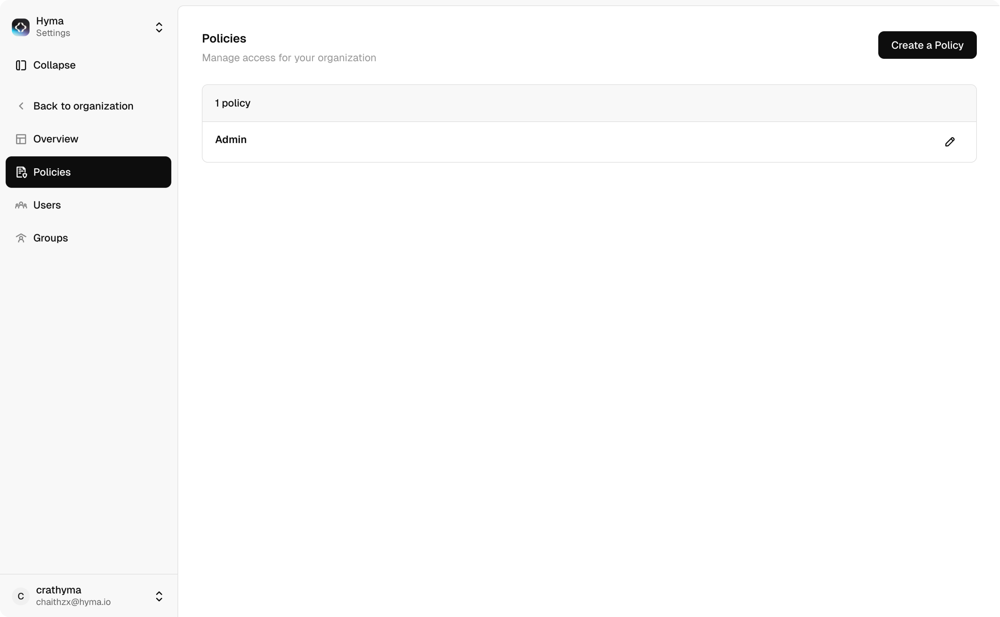

# Using Tokens Studio for Figma



### Open a Figma design file

This can be an empty file to ensure that your production designs are not affected while setting up connection with Studio.



### Install/Launch Tokens Studio for Figma

1. Go to Plugins > Tokens Studio for Figma.
2. In the plugin’s interface, open a "New empty file".

<figure><figcaption></figcaption></figure>



### Adding a new sync provider

1. Open the Settings tab on the plugin.
2. Click on Add new sync provider.
3. Select Token Studio from the list.

<figure><figcaption></figcaption></figure>



### Setting up Token Studio sync

1. Return to Studio and go to the dashboad on the left panel.
2. Click on Find your API key. You can also jump to the API keys page by using the keyboard shortcut cmd+k.
3. The API key is linked to the user which means that it gives access to all the Organisations and Projects that a user is part of.&#x20;

For more info read [Platform > API keys](../../platform/platform/api-keys.md).

<figure><figcaption></figcaption></figure>



### Creating your API key

1. Click on create a new key.
2. Give your API key a name.
3. (Optional) Give your API key a description.
4. Click create.
5. Copy your API key.&#x20;

IMPORTANT: Your API key will not be visible again, so make sure to copy it.

<figure><figcaption></figcaption></figure>



### Finish adding Studio sync on the plugin

1. Return to Figma, on the plugin click already have access.
2. Give a name for the sync for easy identification.
3. Enter the API key in the Personal Access Token field.
4. Choose the Organisation that you want to connect.
5. Choose the Project that you want to connect.
6. You are now connected to Studio and your tokens should reflect in the plugin under the Tokens tab

<figure><figcaption></figcaption></figure>




### Bi-directional syncing

1. Connection with Studio and the plugin is a bi-directional sync.
2. Any changes on Studio can be pulled in the plugin by clicking on sync icon at the bottom left of the plugin.
3. Any changes on the plugin will be automatically updated on the studio.&#x20;


