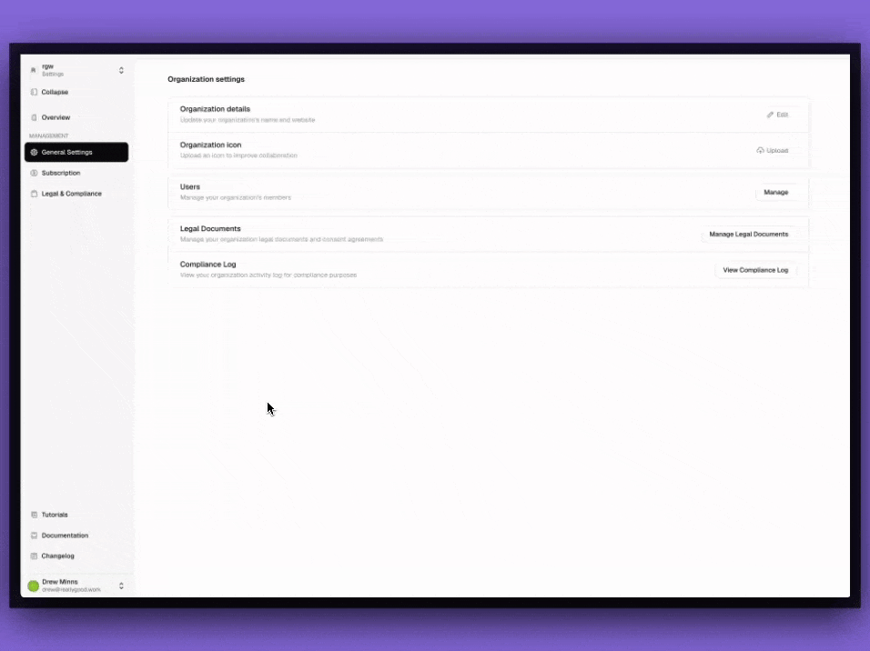

# Accounts

The **Accounts Menu** in Studio provides you with the tools to manage your profile, API Keys for connecting Studio to design tools and plugins, and UI theme preferences.

## Where to find the Accounts Menu

<figure><figcaption></figcaption></figure>

Within Studio, you will see your _name_ and _email address_ in the **bottom-left corner of the UI**. Click to open a popup menu with the following options:

* **Edit Profile** – Modify personal details such as name, description, and avatar.
* **API Keys** – Manage personal access tokens for authentication and integration.
* **Share Feedback** – Redirects to the **feature request** and feedback submission platform.
* **Switch to Dark Mode** – Toggle between **light** and **dark** themes.
* **Sign Out** – Log out of your account securely.

***

## Editing Your Profile

<figure><figcaption></figcaption></figure>

1. Click **Edit Profile** in the accounts menu.
2. Modify your **name** or add a short **description**.
3. Upload an **optional avatar** if desired.
4. Click **Save** to confirm changes.

***

## Managing API Keys

<figure><figcaption></figcaption></figure>

Access the [**API Keys**](api-keys.md) page. Where you can:

* Generate new API keys.
* View and manage existing API keys.
* Copy keys for integration with Studio plugins.


**Important:** API keys are only shown once upon creation—ensure you store them securely. If you lose track of the key, you'll need to generate a new one.


***

## Providing Feedback

Selecting **Share Feedback** will redirect you to the **Tokens Studio feedback platform**, where you can submit feature requests and report issues.

***

## Changing the Theme

<figure><figcaption></figcaption></figure>

You can toggle between Dark and Light Mode directly from the account menu to adjust their interface preferences. The selected value will be stored locally in your browser and persisted for future visits.

***

## Signing Out

Click **Sign Out** to securely log out of Studio and your current session.
