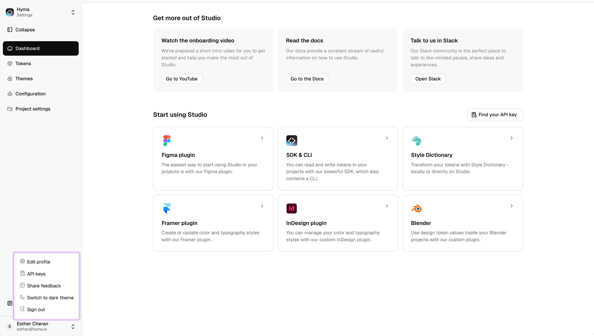

# Accounts

The **Accounts Menu** in Studio provides users with access to profile settings, API keys, feedback options, theme preferences, and sign-out functionality.

### Accessing the Accounts Menu

1. **Open Studio** and locate the left panel.
2. Scroll to the **bottom left corner** to find your **name and email address**.
3. Click on your **profile** to open the accounts menu.

<figure><figcaption></figcaption></figure>

### Account Menu Options

After clicking on your profile, you’ll see the following options:

* **Edit Profile** – Modify personal details such as name, description, and avatar.
* **API Keys** – Manage personal access tokens for authentication and integration.
* **Share Feedback** – Redirects to the **feature request** and feedback submission platform.
* **Switch to Dark Mode** – Toggle between **light** and **dark** themes.
* **Sign Out** – Log out of your account securely.

### Editing Your Profile

1. Click **Edit Profile** in the accounts menu.
2. Modify your **name** or add a short **description**.
3. Upload an **optional avatar** if desired.
4. Click **Save** to confirm changes.

<figure><figcaption></figcaption></figure>

### Managing API Keys

For **API key management**, visit the [**API Keys**](api-keys.md) section. Here, users can:

* Generate new API keys.
* View and manage existing API keys.
* Copy keys for integration with Studio.

> 📌 **Important:** API keys are only shown once upon creation—ensure you store them securely.

<figure><figcaption></figcaption></figure>

### Providing Feedback

* Selecting **Share Feedback** redirects to the **Tokens Studio feedback platform**, where users can submit feature requests and report issues.

### Changing the Theme

* Users can **switch to Dark Mode** directly from the account menu to adjust their interface preferences.

<figure><figcaption></figcaption></figure>

### Signing Out

* Click **Sign Out** to securely log out of Studio.
