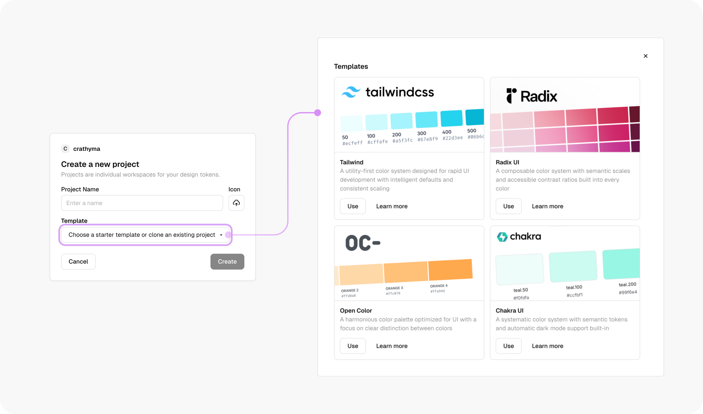

# Project

## Managing Projects in Studio

Studio supports managing multiple projects within an organization, allowing teams to work on separate design systems or initiatives efficiently. This guide walks you through viewing, creating, and managing projects.

### Creating a New Project

To create a new project:

1. Click the dropdown at the top of the interface, next to the current project name.
2. Select **Create New Project**.
3. In the popup modal:
   * Enter a project name.
   * (Optional) Choose a project icon.
   * Select a starter template or begin with a blank project.

<figure><figcaption></figcaption></figure>

#### Starter Templates

Tokens Studio provides starter templates for popular frameworks:

* **Tailwind**
* **Radix UI**
* **Chakra UI**
* **Open Color**

Choose a template that matches your design system needs, or opt for a blank setup to create your project from scratch.

Once the project is created, you’ll be redirected to the **Project Dashboard**.

<figure><figcaption></figcaption></figure>

### Viewing Your Projects

To view your projects, navigate to the **Projects** section in the side panel. Here, you'll see a list of all the projects associated with your organization.&#x20;

* Switch between projects by selecting the desired project from the list.
* Access **Project Settings** directly from this panel.

### Accessing Project Settings

Each project has a dedicated settings page, where you can:

* **View project details** such as the project name and icon.
* **Update the project icon** to better reflect the project identity.
* **Delete the project** if it's no longer needed.

To open project settings:

1. Click the project name in the side panel.
2. Select **Settings** from the dropdown menu.

Alternatively, access **Project Settings** from the side panel.

<figure><figcaption></figcaption></figure>
