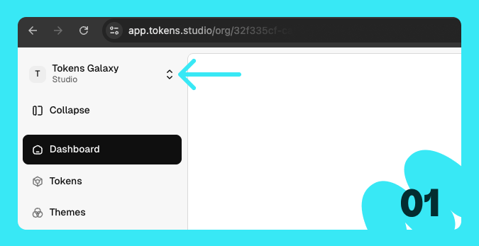
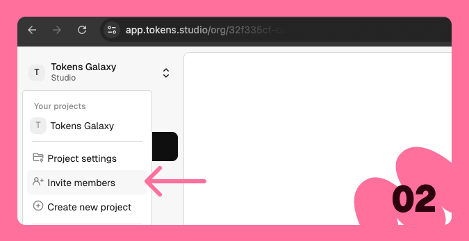
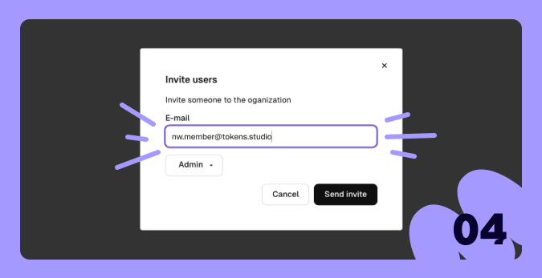

# Inviting members



### Under your project name, you'll find a small menu.

<figure><figcaption></figcaption></figure>



### Click on 'Invite members.

This will open a page.

<figure><figcaption></figcaption></figure>



### Here you see all the current members.&#x20;

Via the button 'Invite users' you will be able to invite new members

<figure><figcaption></figcaption></figure>



### Just drop the mail address and hit the button!

An invite will be sent to the email address.&#x20;

<figure><figcaption></figcaption></figure>



